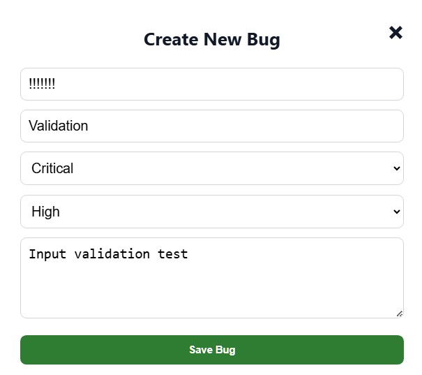
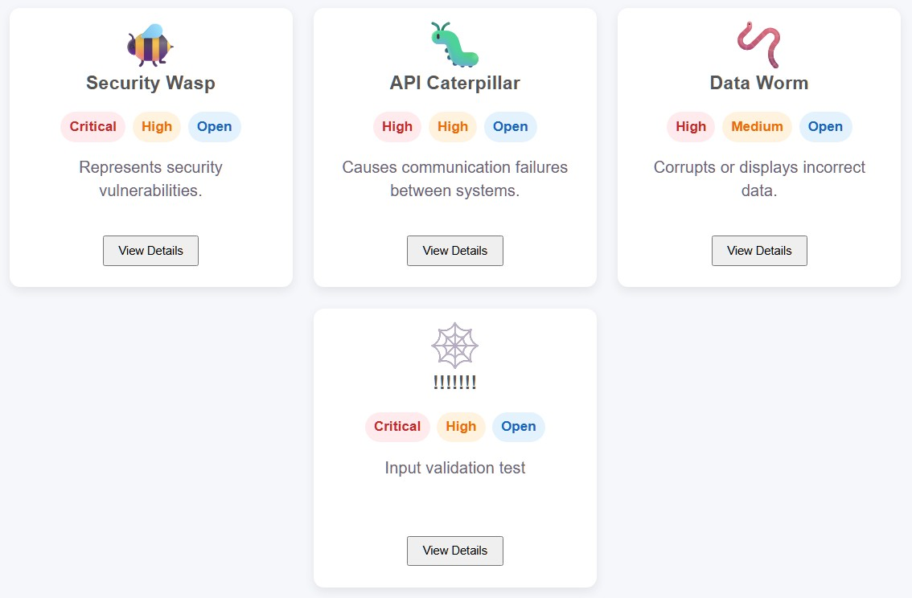
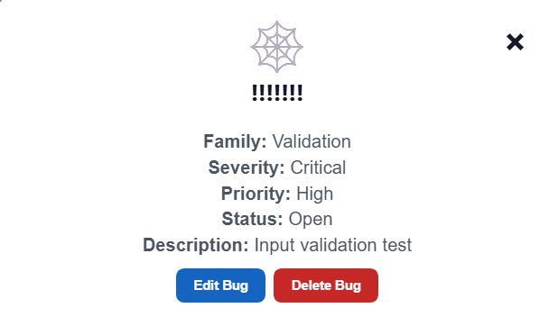

# BUG-001 - Bug Name Field Accepts Values Containing Only Numbers or Special Characters

## Summary

The bug creation form allows bug names containing only numeric values or special characters.

Examples successfully accepted by the application include:

* `123456`
* `@`
* `!!!!!!!`

This behavior allows non-descriptive bug records to be created, reducing data quality and making bug identification more difficult.

---

## Severity

Medium

---

## Priority

Low

---

## Environment

* **Application:** QAce Bug Lab
* **Version:** Current Development Version
* **Browser:** Google Chrome
* **Platform:** Windows 11

---

## Preconditions

* User is logged in.
* User is on the dashboard.
* User has access to the **Create Bug** form.

---

## Steps to Reproduce

### Scenario 1 - Numeric Name

1. Click **+ Add Bug**.
2. Enter `123456` as the bug name.
3. Complete all remaining required fields.
4. Click **Save Bug**.

### Scenario 2 - Special Character Name

1. Click **+ Add Bug**.
2. Enter `@` as the bug name.
3. Complete all remaining required fields.
4. Click **Save Bug**.

### Scenario 3 - Multiple Special Characters

1. Click **+ Add Bug**.
2. Enter `!!!!!!!` as the bug name.
3. Complete all remaining required fields.
4. Click **Save Bug**.

---

## Expected Result

The application should reject bug names that do not contain meaningful alphabetic characters.

A validation message should inform the user that the bug name must contain descriptive text.

Examples that should be rejected include:

* `123456`
* `@`
* `!!!!!!!`

---

## Actual Result

The application accepts and saves bug names containing only numbers or special characters.

The invalid record is successfully persisted and displayed on the dashboard.

---

## Impact

* Reduces data quality.
* Makes bug identification more difficult.
* Allows non-descriptive records to be stored.
* May negatively affect future search, reporting and maintenance activities.

---

## Evidence

### Screenshot 1 – Create Bug Form

The **Create Bug** form accepts a bug name containing only special characters without displaying any validation message.

---

### Screenshot 2 – Dashboard

After saving, the invalid bug is successfully displayed on the dashboard.

---

### Screenshot 3 – Bug Details

The bug details modal confirms that the invalid bug name has been successfully persisted.

---

## Status

Open

---

## QA Notes

This defect was identified during exploratory testing focused on input validation and edge-case analysis of the **Create Bug** workflow.

The issue does not prevent normal application usage; however, it compromises data quality by allowing records with non-descriptive names to be stored.

The screenshots above demonstrate the complete defect lifecycle:

* The invalid input is accepted.
* The record is successfully created.
* The invalid value is persisted by the application.
